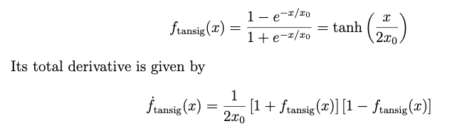
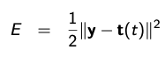
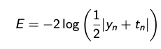

# Neural Network Project
 ## Table of contents

    <ol>
        <li><a href="#ref1">Aim</a></li>
        <li><a href="#ref1">Input</a></li>
        <li><a href="#ref2">Transfer Function</a></li>
        <ul>
         <li><a href="#ref3"> Bipolar Sigmoid Transfer Function</a></li>
         <li><a href="#ref4">Bipolar Sigmoid Transfer Function Derivative</a></li>
        </ul>
        <li><a href="#ref2">Cost Function</a></li>
        <ul>
         <li><a href="#ref3"> Quadratic Cost Function</a></li>
         <li><a href="#ref4">Bipolar Cross-entropy Cost Function</a></li>
        </ul>
        <li><a href="#ref5">Termination Condition</a></li>
    </ol>

 

## 1. Aim: 
 1. In this Project main aim is to build a three layer feed- forward neural network with N0 neurons in the input layer, N1 neurons in the hidden layer, and N2 neurons in the output layer. Use the backpropagation to solve a classi- fication problem. Your program must be able to accept rather general values for N0, N1 and N2.

 2. Use initial weights and biases that are created randomly and uniformly with values between −ζ and ζ.

 3. Explore the following 4 hyper-parameters of the problem: 
    N1, α, ζ, and x0. Perform calculations using the following choices of parameter values: 

    α = 0.1, 0.2, 0.3, 

    ζ = 0.5, 1.0, 1.5, and 

    x0 =0.5,1.0,1.5.

4. For N1 = 1, 2, 4, 6, 8, 10, run your program 100 times, each time using randomly created weights and biases. Use the same training rate and T as before. For a given N1, report the number of times there is no convergence. For the remaining cases where you have convergent results, report the number of epochs needed, the average and median number of epochs. as well as the minimum and maximum number of epochs.

5. Do all the steps for Quadratic Cost function as well as bipolar cross-entropy cost function

 ## 2. Input
 For now we will consider this as our training set ( XOR logic function):
 |x1|x2|y|
|-|-|-|
|1|1|-1|
|1|-1|1|
|-1|1|1|
|-1|-1|-1|

## 3. Transfer Function 
Since the input is bipolar we will be using Bipolar Sigmoid Trasnfer function

 

We have introduced a positive parameter x0, which sets the scale for the argument of the transfer function. Note that the smaller x0 is, the more abrupt the transfer function switches from −1 to +1.

## 4. Cost Functions
**1. Quadratic Cost Function**

**2. Bipolar Cross-entropy Cost Function**

## 5. Termination Condition
During training, if s(q) is presented to the neural network, and if the network output is y, then the error is given by 

    e(q) = y − t(q)

The square errors are summed at the end of each epoch, and if
this sum is smaller than a given tolerance T, then training is terminated. Try using T = 0.05.